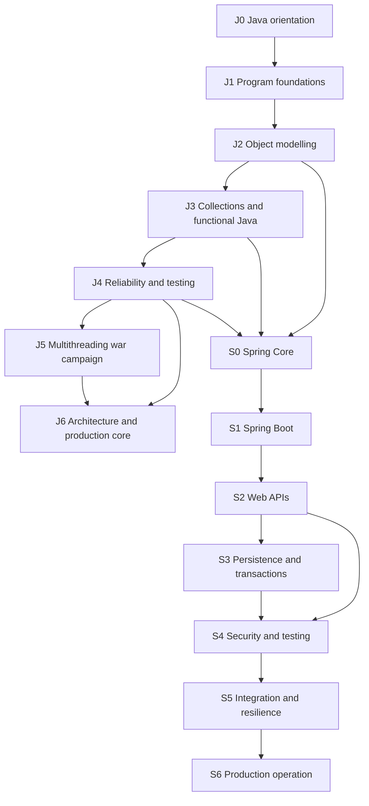

# Phase 0 — Curriculum and Dependency Audit

## 1. Outcome

Phase 0 establishes the authoritative teaching order for LevelCraft's Java 17 and Spring Boot campaigns.

The audit confirms that the current ten missions per track are useful as campaign summaries but are too broad to remain individual learner missions. They will be retained as source material and decomposed into smaller, dependency-aware missions.

### Decisions

- Keep Java 17 as the implementation baseline.
- Keep Student Registration and Management as the continuous first domain.
- Preserve existing ranks, rewards and gamified terminology.
- Split large missions rather than adding more material to already oversized pages.
- Teach plain Java construction, collections and repository boundaries before Spring abstractions.
- Expand multithreading into its own campaign.
- Keep one canonical concept explanation and vary scaffolding by learner level.
- Keep all missions available to the product owner through Content Review Mode until approval.

---

## 2. Audit method

The audit reviewed:

- `app/content/curriculum.ts`;
- `app/content/training-depth.ts`;
- `app/content/learner-levels.ts`;
- `LEVELCRAFT-2.0-PLAN.md`;
- `LEVELCRAFT-LEARNING-SYSTEM-PLAN.md`;
- the continuous Student Management domain requirement;
- the Java 17 scope boundary;
- current mission durations, objectives, lessons, training prompts and quests.

Each current mission received one of these decisions:

- **Keep:** scope is suitable with editorial enhancement.
- **Split:** concepts must become multiple missions.
- **Merge:** material belongs inside another mission.
- **Rewrite:** intent remains useful but sequencing or assumptions are unsuitable.
- **Retire:** material is duplicated, obsolete or outside scope.

No current mission is retired completely. Most are split and rewritten.

---

## 3. High-level prerequisite graph

### Critical dependency rules

| Dependent concept | Required earlier knowledge | Reason |
| --- | --- | --- |
| Repository interface | Classes, interfaces, collections | A repository must first be understood as a Java boundary, not Spring magic |
| Lambdas | Methods, interfaces, generics | Lambdas implement functional-interface contracts |
| Streams | Collections, lambdas, generics | Stream pipelines operate on typed data and behavioural functions |
| Records | Classes, constructors, immutability | Learners must understand what records simplify and what they do not replace |
| CompletableFuture | Threads, tasks, executors, Future | Composition is meaningless without the execution and completion model |
| Spring IoC | Constructors, interfaces, manual wiring | Spring automates responsibilities the learner must first see explicitly |
| Spring Data JPA | Repository boundary, SQL and relational concepts | The abstraction must not conceal storage and query costs |
| Transactions | Domain operation boundaries and persistence failure | Learners need to understand what must succeed or roll back together |
| Spring Security | HTTP, controllers and application boundaries | Security rules protect requests and resources already understood |
| Resilience | HTTP clients, failures and idempotency | Retries without these concepts create duplicate or cascading failures |

---

## 4. Java 17 target inventory

Mission IDs below are stable planning IDs. They should remain stable after publication so learner progress can survive content revisions.

### J0 — Hunter Orientation

| ID | Mission | Concepts | Prerequisites | Domain increment |
| --- | --- | --- | --- | --- |
| J0.1 | From source to running program | JDK, `javac`, bytecode, JVM, compile-time versus runtime | None | Run the first Student application |
| J0.2 | Workbench and debugging | IntelliJ project, packages, console, breakpoints, stack traces | J0.1 | Inspect Student application execution |
| J0.T | Orientation trial | Repair compilation, package and runtime mistakes | J0.1–J0.2 | Restore a broken starter application |

### J1 — Program Foundations, Rank E

| ID | Mission | Concepts | Prerequisites | Domain increment |
| --- | --- | --- | --- | --- |
| J1.1 | Values and types | primitives, references, variables, scope, constants | J0.T | Represent student input |
| J1.2 | Expressions and safe calculations | operators, conversions, precedence, exact decimal awareness | J1.1 | Calculate registration totals or credits |
| J1.3 | Decision gates | booleans, `if`, guard clauses, switch expressions | J1.1 | Validate basic eligibility |
| J1.4 | Bounded repetition | `for`, `while`, termination and tracing | J1.3 | Process several student entries |
| J1.5 | Behaviour in methods | parameters, return values, overload awareness, method contracts | J1.1–J1.4 | Extract validation methods |
| J1.6 | Text and defensive input | String, Scanner, parsing, null/blank awareness | J1.3–J1.5 | Build console registration intake |
| J1.T | Foundation Gate trial | combine input, conditions, loops and methods | J1.1–J1.6 | Deliver validated console intake |

### J2 — Object Modelling, Rank D

| ID | Mission | Concepts | Prerequisites | Domain increment |
| --- | --- | --- | --- | --- |
| J2.1 | Classes and objects | state, behaviour, identity, object creation | J1.T | Create Student class |
| J2.2 | Constructors and invariants | constructors, validation, encapsulation, accessors | J2.1 | Prevent invalid students |
| J2.3 | Class boundaries | packages, access modifiers, static versus instance | J2.2 | Organize domain packages |
| J2.4 | Composition before inheritance | has-a, is-a, substitutability, coupling | J2.2–J2.3 | Compose Student contact details |
| J2.5 | Interfaces and polymorphism | contracts, implementations, substitution | J2.4 | Define StudentRepository contract |
| J2.6 | Enums, records and immutable values | enums, record classes, equality, appropriate use | J2.2 | Add RegistrationStatus and StudentSummary |
| J2.T | Object Builder trial | model a valid domain with replaceable storage | J2.1–J2.6 | Deliver domain model and repository contract |

### J3 — Data and Functional Java, Rank C

| ID | Mission | Concepts | Prerequisites | Domain increment |
| --- | --- | --- | --- | --- |
| J3.1 | Arrays and lists | fixed versus dynamic storage, ordering, iteration | J1.T | Store multiple students |
| J3.2 | Sets and maps | uniqueness, keyed lookup, collection selection | J3.1 | Enforce unique student IDs |
| J3.3 | Generics and type safety | generic types, methods, bounds awareness | J2.5, J3.1 | Type-safe repository operations |
| J3.4 | Equality and hashing | `equals`, `hashCode`, identity versus value | J2.6, J3.2 | Correct duplicate detection |
| J3.5 | Functional interfaces and lambdas | built-in functional interfaces, lambda capture | J2.5, J3.3 | Configurable eligibility rules |
| J3.6 | Stream pipeline foundations | source, intermediate and terminal operations | J3.1, J3.5 | Search and filter students |
| J3.7 | Sorting, grouping and reduction | comparators, collectors, aggregation | J3.4, J3.6 | Produce registration reports |
| J3.8 | Loops versus streams | clarity, mutation, side effects, parallel-stream caution | J3.6–J3.7 | Select maintainable reporting style |
| J3.T | Data Gate trial | choose structures and create reports | J3.1–J3.8 | Deliver in-memory search and reporting |

### J4 — Reliability and Testing, Rank C/B

| ID | Mission | Concepts | Prerequisites | Domain increment |
| --- | --- | --- | --- | --- |
| J4.1 | Exceptions and stack traces | exception hierarchy, propagation, stack reading | J2.T | Identify registration failures |
| J4.2 | Failure contracts | checked/unchecked, domain exceptions, translation | J4.1 | Add meaningful registration errors |
| J4.3 | Validation results | collecting input issues, exceptions versus expected errors | J4.1–J4.2 | Return complete validation feedback |
| J4.4 | Resources and diagnostics | try-with-resources, causes, logging fundamentals | J4.2 | Import students safely |
| J4.5 | Unit-test foundations | arrange/act/assert, boundaries, parameterized tests | J2.T, J4.2 | Prove registration rules |
| J4.6 | Test doubles and determinism | fakes, stubs, clocks, randomness and isolation | J2.5, J4.5 | Test services independently |
| J4.7 | Refactoring with protection | code smells, extraction, behaviour-preserving change | J4.5–J4.6 | Improve service design safely |
| J4.T | Reliability Gate trial | diagnose, test and refactor failures | J4.1–J4.7 | Deliver reliable tested application core |

### J5 — Multithreading War Campaign, Rank B/A

| ID | Mission | Concepts | Prerequisites | Domain increment |
| --- | --- | --- | --- | --- |
| J5.1 | Concurrency mental model | process, thread, task, concurrency versus parallelism | J4.T | Identify concurrent registration work |
| J5.2 | Thread lifecycle | Thread, Runnable, start/join, interruption | J5.1 | Run independent notification task |
| J5.3 | Shared mutable state | compound actions, race conditions, lost updates | J5.2 | Reproduce course oversubscription |
| J5.4 | Java Memory Model | atomicity, visibility, ordering, happens-before | J5.3 | Explain stale capacity reads |
| J5.5 | Intrinsic locking | `synchronized`, monitor, lock scope | J5.4 | Protect seat reservation |
| J5.6 | Explicit locks | ReentrantLock, try/finally, Condition | J5.5 | Coordinate registration states |
| J5.7 | Atomics | CAS mental model, AtomicInteger/Reference, limitations | J5.4 | Implement safe counters |
| J5.8 | Concurrent collections | ConcurrentHashMap, blocking queues, compound operations | J5.4, J3.2 | Maintain concurrent registration indexes |
| J5.9 | Coordination primitives | wait/notify awareness, latch, barrier, semaphore | J5.5 | Coordinate batch enrolment |
| J5.10 | ExecutorService | task submission, queues, sizing, rejection and shutdown | J5.2 | Bound registration workers |
| J5.11 | Callable and Future | results, timeout, cancellation, execution failure | J5.10 | Retrieve validation outcomes |
| J5.12 | CompletableFuture | composition, combine, handle, timeout, executor choice | J5.11, J3.5 | Combine profile and eligibility checks |
| J5.13 | Liveness failures | deadlock, livelock, starvation and thread dumps | J5.5–J5.10 | Diagnose frozen registration |
| J5.14 | Deterministic concurrency tests | latches, barriers, repeated assertions, no guessed sleeps | J5.3, J4.5 | Prove race repair |
| J5.15 | Capacity and backpressure | bounded queues, saturation, throughput, failure policy | J5.10–J5.12 | Protect service under registration spikes |
| J5.T | War Campaign trial | repair race, deadlock and executor leak | J5.1–J5.15 | Deliver safe concurrent enrolment |

### J6 — Architecture and Production Core, Rank A/S

| ID | Mission | Concepts | Prerequisites | Domain increment |
| --- | --- | --- | --- | --- |
| J6.1 | Layered responsibilities | domain, application, infrastructure, dependency direction | J4.T | Separate registration layers |
| J6.2 | Repository without magic | ports, adapters, in-memory implementation | J2.5, J3.T, J6.1 | Stabilize storage boundary |
| J6.3 | Persistence and SQL awareness | files, relational concepts, query costs | J4.4, J6.2 | Add simple durable storage |
| J6.4 | Transaction boundaries | atomic business operation, commit/rollback concept | J4.2, J6.3 | Define consistent registration operation |
| J6.5 | Configuration and packaging | configuration boundary, JAR, environment and diagnostics | J0.T, J6.1 | Package the Java application |
| J6.T | Java Legend trial | architecture, tests, concurrency and operation | J5.T, J6.1–J6.5 | Complete selectable Java capstone |

---

## 5. Spring and Spring Boot target inventory

### Spring prerequisite gate

The standard Spring campaign requires J2.T, J3.T and J4.T. A learner may enter through a diagnostic gate, but unmet concepts produce Java remediation recommendations.

### S0 — Spring Core, Rank E

| ID | Mission | Concepts | Prerequisites | Domain increment |
| --- | --- | --- | --- | --- |
| S0.1 | The construction problem | tight coupling, manual wiring, composition root | J2.5, J6.2 awareness | Wire repository and service manually |
| S0.2 | IoC, beans and ApplicationContext | inversion of control, bean definitions, container role | S0.1 | Move creation responsibility to Spring |
| S0.3 | Component discovery | scanning, stereotypes, configuration boundaries | S0.2 | Discover Student components |
| S0.4 | Constructor injection | required dependencies, immutability, testability | S0.1–S0.3 | Inject StudentRepository |
| S0.5 | Setter injection | optional/reconfigurable collaborators, partial state risk | S0.4 | Compare optional notification dependency |
| S0.6 | Field injection | reflection-based injection, hidden dependency and test cost | S0.4–S0.5 | Implement then reject field design deliberately |
| S0.7 | Required and optional dependencies | contracts, nullability, Optional misuse awareness | S0.4–S0.6 | Classify service collaborators |
| S0.8 | Multiple implementations | `@Primary`, `@Qualifier`, collections of beans | S0.3–S0.7 | Choose in-memory or audit repository intentionally |
| S0.9 | Scopes and lifecycle | singleton/prototype/request awareness, lifecycle callbacks | S0.2 | Avoid mutable singleton learner state |
| S0.T | Spring Core Gate trial | wire, compare, test and defend designs | S0.1–S0.9 | Deliver Spring-managed application core |

### S1 — Spring Boot Fundamentals, Rank D

| ID | Mission | Concepts | Prerequisites | Domain increment |
| --- | --- | --- | --- | --- |
| S1.1 | Spring versus Spring Boot | application structure, launcher, embedded server | S0.T | Create Boot project |
| S1.2 | Starters and dependency management | starter purpose, transitive dependencies, build file | S1.1 | Add web capability intentionally |
| S1.3 | Auto-configuration | conditions, classpath signals, backing off | S1.2 | Inspect configured beans |
| S1.4 | External configuration | properties, YAML, binding and precedence | S1.1–S1.3 | Configure registration limits |
| S1.5 | Profiles, environment and secrets | environment separation, profile limits, secret boundaries | S1.4 | Separate development/test configuration |
| S1.6 | Startup and logging diagnostics | condition report, startup failure, useful logs | S1.3–S1.5 | Diagnose broken configuration |
| S1.T | Boot Gate trial | configure and diagnose a Boot service | S1.1–S1.6 | Deliver configurable service foundation |

### S2 — Web API Development, Rank C

| ID | Mission | Concepts | Prerequisites | Domain increment |
| --- | --- | --- | --- | --- |
| S2.1 | HTTP and REST mental model | request/response, methods, resource, safety/idempotency awareness | S1.T | Define Student API contract |
| S2.2 | Controllers and mappings | controller role, route, parameter and body binding | S2.1 | Expose registration endpoint |
| S2.3 | DTOs, records and entity separation | boundary models, mapping, compatibility | J2.6, S2.2 | Create request/response DTOs |
| S2.4 | JSON behaviour | serialization, naming, dates and malformed payloads | S2.3 | Stabilize API representation |
| S2.5 | Bean Validation | constraints, nested validation, custom domain validation | J4.3, S2.3 | Validate registration request |
| S2.6 | Status and response design | status codes, headers, location and error semantics | S2.1–S2.5 | Return correct outcomes |
| S2.7 | Global exception handling | boundary translation, problem details, diagnostic separation | J4.2, S2.6 | Standardize API failures |
| S2.8 | Compatibility and versioning | additive change, breaking change, version strategies | S2.3–S2.7 | Evolve Student API safely |
| S2.T | Web API Gate trial | build and test a complete HTTP workflow | S2.1–S2.8 | Deliver validated registration API |

### S3 — Persistence and Transactions, Rank B

| ID | Mission | Concepts | Prerequisites | Domain increment |
| --- | --- | --- | --- | --- |
| S3.1 | Relational and SQL foundations | table, row, key, constraint, join, index | J6.3, S2.T | Design Student schema |
| S3.2 | Entities and identity | entity state, identifiers, equality and lifecycle | S3.1, J3.4 | Map Student entity |
| S3.3 | Relationships and loading | cardinality, ownership, lazy/eager costs | S3.2 | Map Course and Registration |
| S3.4 | Spring Data repositories | generated implementation, inherited operations, boundary placement | J6.2, S3.2 | Replace in-memory repository |
| S3.5 | Queries and projections | derived query, explicit query, projection and specification awareness | S3.4 | Search students efficiently |
| S3.6 | Transaction behaviour | boundary, rollback, propagation awareness, self-invocation trap | J6.4, S3.4 | Make registration atomic |
| S3.7 | Query performance | N+1, pagination, fetch planning and indexes | S3.3–S3.6 | Make reporting scalable |
| S3.8 | Schema migrations | versioned migration, seed separation, rollback thinking | S3.1–S3.7 | Reproduce database setup |
| S3.T | Persistence Gate trial | persist, query and roll back correctly | S3.1–S3.8 | Deliver PostgreSQL-backed workflow |

### S4 — Security and Quality, Rank B

| ID | Mission | Concepts | Prerequisites | Domain increment |
| --- | --- | --- | --- | --- |
| S4.1 | Authentication, authorization and filters | security boundary, principal, filter chain | S2.T | Classify protected operations |
| S4.2 | Passwords, sessions and tokens | hashing, credential handling, stateful/stateless trade-offs | S4.1 | Add safe identity foundation |
| S4.3 | Roles and permissions | request and method authorization, ownership checks | S4.1–S4.2 | Separate student/admin actions |
| S4.4 | CSRF, CORS and secure defaults | browser threat model, origins, headers | S2.1, S4.2 | Secure web boundaries |
| S4.5 | Unit tests in Spring code | plain unit tests, mocks only at boundaries | J4.5–J4.6, S0.T | Test StudentService quickly |
| S4.6 | MVC slice tests | controller contract, validation and security | S2.T, S4.1 | Prove API behaviour |
| S4.7 | Integration and database tests | context test, Testcontainers strategy, test data | S3.T, S4.5 | Prove persistence workflow |
| S4.T | Security and Quality trial | protect and prove a full workflow | S4.1–S4.7 | Deliver secured tested API |

### S5 — Integration and Resilience, Rank A

| ID | Mission | Concepts | Prerequisites | Domain increment |
| --- | --- | --- | --- | --- |
| S5.1 | HTTP clients and timeouts | client boundary, connection/read timeout, error mapping | S2.T, J4.2 | Call notification/profile service |
| S5.2 | Retries and unsafe repetition | transient failure, backoff, retry budget, amplification | S5.1 | Retry only safe operations |
| S5.3 | Idempotency | idempotency key, duplicate request and operation identity | S2.1, S3.6, S5.2 | Prevent duplicate registration |
| S5.4 | Circuit breakers and bulkheads | state model, isolation and fallback | S5.1–S5.2 | Contain downstream outage |
| S5.5 | Async work and messaging awareness | hand-off, delivery semantics, eventual completion | J5.12, S5.3 | Send registration notifications |
| S5.6 | Consistency and failure boundaries | local transaction, compensation and eventual consistency | S3.6, S5.3–S5.5 | Recover partial integration failure |
| S5.T | Resilience Gate trial | diagnose timeout, duplicate and outage cascade | S5.1–S5.6 | Deliver resilient integration flow |

### S6 — Production Operation, Rank A/S

| ID | Mission | Concepts | Prerequisites | Domain increment |
| --- | --- | --- | --- | --- |
| S6.1 | Health and readiness | Actuator, liveness, readiness and dependency health | S1.T, S3.T | Expose operational health |
| S6.2 | Logs, metrics and traces | correlation, structured logging, golden signals, trace context | S6.1, S5.T | Observe registration flow |
| S6.3 | Production configuration | environment binding, validation and secrets | S1.4–S1.5 | Harden production configuration |
| S6.4 | Containers and deployment | image, runtime configuration, ports and immutable deploy | S6.3 | Package service for deployment |
| S6.5 | Capacity and protection | pools, connection limits, rate limits and load assumptions | J5.15, S3.7, S6.2 | Protect peak registration |
| S6.6 | Graceful shutdown | draining, in-flight work and lifecycle | J5.10, S6.4–S6.5 | Stop without lost work |
| S6.7 | Incident diagnosis | symptom, signal, hypothesis, mitigation and follow-up | S6.1–S6.6 | Investigate production scenario |
| S6.T | Spring Legend trial | secure, resilient, observable, deployable capstone | S4.T, S5.T, S6.1–S6.7 | Complete selectable Spring capstone |

---

## 6. Current-to-target mission mapping

### Java

| Current ID | Current title | Decision | Target destination | Reason |
| --- | --- | --- | --- | --- |
| 0 | How Java becomes a running program | Split + rewrite | J0.1, J0.2, J1.1, J1.2 | Runtime setup and language values are separate beginner concerns |
| 1 | Decisions, loops and defensive input | Split + rewrite | J1.3–J1.6 | Four skills require their own demonstrations and practice |
| 2 | Model behavior with classes and encapsulation | Split + rewrite | J2.1–J2.4 | Classes, invariants and inheritance/composition should not arrive together |
| 3 | Interfaces, lambdas and SOLID boundaries | Split + rewrite | J2.5, J3.3, J3.5, J6.1 | Lambdas require generics and functional interfaces; architecture comes later |
| 4 | Collections, generics and stream pipelines | Split + rewrite | J3.1–J3.8 | This currently compresses an entire rank into one mission |
| 5 | Exceptions, validation and reliable APIs | Split + rewrite | J4.1–J4.4 | Validation feedback and exceptional failure must be distinguished |
| 6 | Java 17 multithreading war camp | Split + expand | J5.1–J5.15 | Major focus area needs progressive theory, labs and diagnosis |
| 7 | Unit tests, integration tests and refactoring | Split + rewrite | J4.5–J4.7 | Testing concepts require repeated use before refactoring assessment |
| 8 | Architecture, persistence and transaction boundaries | Split + rewrite | J6.1–J6.5 | Architecture, storage and transactions are separate dependencies |
| 9 | Java 17 production capstone | Keep + restructure | J6.T | Retain selectable domain but add staged checkpoints and evidence |

### Spring Boot

| Current ID | Current title | Decision | Target destination | Reason |
| --- | --- | --- | --- | --- |
| 0 | IoC, all DI styles and the ApplicationContext | Split + rewrite | S0.1–S0.9 | The learner must see manual wiring and each injection style independently |
| 1 | Boot auto-configuration, starters and external configuration | Split + rewrite | S1.1–S1.6 | Boot startup, dependency management and configuration need separate feedback loops |
| 2 | REST controllers, DTOs and validation contracts | Split + rewrite | S2.1–S2.6 | HTTP must precede annotations and DTO/validation concerns |
| 3 | Global errors, logging and API observability | Split + relocate | S2.7, S6.2, S6.7 | API error translation and production observability belong at different stages |
| 4 | Spring Data JPA entities, repositories and transactions | Split + rewrite | S3.1–S3.8 | SQL, entities, repository abstraction and transactions require progressive foundations |
| 5 | Spring Security authentication and authorization | Split + rewrite | S4.1–S4.4 | Threat model and identity concepts must precede configuration |
| 6 | Spring testing from unit to container | Split + integrate | S4.5–S4.7 plus tests in every prior arc | Testing should recur rather than exist only as a late topic |
| 7 | HTTP clients, resilience and idempotency | Split + rewrite | S5.1–S5.6 | Timeout, retry, idempotency and failure isolation have strict dependencies |
| 8 | Actuator, metrics, configuration and deployment | Split + rewrite | S6.1–S6.7 | Operations needs health, telemetry, capacity and incident progression |
| 9 | Spring Boot enterprise capstone | Keep + restructure | S6.T | Retain selectable domain but require security and operational evidence |

---

## 7. Gap, duplication and overload findings

### Missing or insufficiently explicit

- Java IDE setup, packages and debugging.
- Methods as a dedicated foundation topic.
- String handling and parsing.
- Static versus instance design.
- Equality and hashing before sets/maps.
- Stream side effects and parallel-stream caution.
- Failure classification: validation versus absence versus infrastructure failure.
- Logging as diagnostic design rather than print replacement.
- Java Memory Model and happens-before.
- Interruption, cancellation, executor rejection and shutdown.
- Deterministic concurrency testing.
- HTTP fundamentals before Spring MVC annotations.
- SQL and relational foundations before JPA.
- DTO/entity mapping and compatibility reasons.
- Spring Data query cost and N+1 diagnosis.
- Security filter-chain mental model.
- CSRF and CORS threat models.
- Retry amplification and idempotency relationship.
- Graceful shutdown and capacity protection.
- Explicit evidence rules for quests and trials.

### Duplicated or misplaced

- Architecture language appears in early interface material before enough concrete experience.
- Observability appears alongside API errors even though production telemetry belongs later.
- Testing is concentrated in dedicated missions instead of being introduced once and reused continuously.
- Repository language appears in Spring learning before some beginners understand plain Java interfaces and collection-backed storage.
- Transaction terminology appears in architecture, JPA and resilience material without one declared foundational definition.

### Oversized current missions

All current missions numbered 3–8 in both tracks exceed the recommended number of new concepts for beginners. Java mission 6 and Spring missions 0, 4, 7 and 8 are the highest-risk overload points.

---

## 8. Java 17 compatibility boundary

### Supported and teachable in the primary path

- record classes;
- sealed classes;
- pattern matching for `instanceof`;
- switch expressions;
- text blocks;
- standard collections and Stream API;
- `ExecutorService`, `Future`, `CompletableFuture`;
- locks, atomics, concurrent collections and coordination primitives.

### Excluded from implementation exercises

- virtual threads;
- structured concurrency;
- record patterns;
- final pattern matching for switch from later Java releases;
- APIs or language syntax introduced after Java 17.

Later-version features may appear only in a clearly labelled awareness note that cannot be required to complete a Java 17 mission.

### Spring baseline rule

The exact Spring Boot minor version must be pinned when starter projects are produced. The content schema must record the tested Spring Boot version. Java 17 remains the LevelCraft application baseline even if the chosen Spring Boot line also supports later JDKs.

### Primary references

- Oracle Java 17 Language Updates: <https://docs.oracle.com/en/java/javase/17/language/index.html>
- Java 17 language change summary: <https://docs.oracle.com/en/java/javase/17/language/java-language-changes-summary.html>
- Java 17 concurrency package: <https://docs.oracle.com/en/java/javase/17/docs/api/java.base/java/util/concurrent/package-summary.html>
- Spring Boot system requirements: <https://docs.spring.io/spring-boot/system-requirements.html>

---

## 9. Student Management feature progression

| Application version | Unlocked after | Functional capability | New engineering burden |
| --- | --- | --- | --- |
| V0 Hello Hunter | J0.T | application compiles, runs and is debugged | environment correctness |
| V1 Console Intake | J1.T | capture and validate one or more student entries | input and control flow |
| V2 Protected Domain | J2.T | valid Student and Registration objects | invariants and object boundaries |
| V3 In-Memory Registry | J3.T | save, find, deduplicate, filter and report | collections, equality and functional processing |
| V4 Reliable Core | J4.T | meaningful failures and tested rules | failure contracts and regression safety |
| V5 Concurrent Enrolment | J5.T | safely allocate limited course seats | race safety, capacity and liveness |
| V6 Java Production Core | J6.T | layered, packaged, configurable application | architecture and operability |
| V7 Spring-Managed Core | S0.T | container-managed components with deliberate DI | lifecycle and dependency configuration |
| V8 Boot Service | S1.T | configurable runnable service | auto-configuration and environments |
| V9 Registration API | S2.T | validated HTTP registration and search | stable API contracts |
| V10 Persistent Registry | S3.T | PostgreSQL-backed atomic registration | schema, query and transaction correctness |
| V11 Secured Service | S4.T | student/admin permissions with test proof | identity, authorization and secure boundaries |
| V12 Resilient Integrations | S5.T | safe downstream notifications and duplicate protection | distributed failure and consistency |
| V13 Production Service | S6.T | observable, deployable and incident-ready system | operational ownership |

### Starter-project policy

- Each application version receives a tag or downloadable archive.
- Every mission states the exact starting version and resulting version.
- Learners can compare their work with a reference only after attempting the quest.
- A migration note explains intentional refactoring between versions.
- Later domains reuse the same engineering standards but provide different business rules.

---

## 10. Rank and trial placement

| Rank gate | Required arcs | Trial evidence |
| --- | --- | --- |
| Java E | J0–J1 | runnable console intake, output checklist and explanation |
| Java D | J2 | protected model, interface implementation and tests for invariants |
| Java C | J3 | correct collection choices and reporting pipeline |
| Java B | J4 and early J5 | reliable service, unit tests and race-condition explanation |
| Java A | J5 | deterministic concurrency diagnosis and repair |
| Java S | J6 | selectable capstone with architecture, tests and operation notes |
| Spring E | S0 | manual versus managed wiring and injection-style defence |
| Spring D | S1 | configurable Boot service and startup diagnosis |
| Spring C | S2 | stable validated HTTP API and contract tests |
| Spring B | S3–S4 | persistent secured workflow with rollback and tests |
| Spring A | S5–S6 | resilient, observable service and incident response |
| Spring S | S6.T | selectable enterprise capstone and evidence portfolio |

---

## 11. Phase 0 exit-criteria assessment

| Exit criterion | Result | Evidence |
| --- | --- | --- |
| Every Java concept has an intended position | Pass | Sections 4 and 8 |
| Every Spring concept has an intended position | Pass | Section 5 |
| High-level prerequisite order is declared | Pass | Section 3 |
| Current missions have explicit decisions | Pass | Section 6 |
| Oversized, duplicate and missing areas identified | Pass | Section 7 |
| Java 17 compatibility boundary recorded | Pass | Section 8 |
| Student Management progression mapped | Pass | Section 9 |
| Review mechanism established | Pass | `CONTENT-REVIEW-SCORECARD.md` |

Phase 0 status: **Complete**.

---

## 12. Inputs handed to Phase 1

Phase 1 should implement:

1. Stable string mission IDs matching this audit.
2. A versioned schema with prerequisite IDs.
3. Build-time validation for missing and cyclic dependencies.
4. Required fields for outcomes, demonstrations, training, checks, notes, quest, evidence and review metadata.
5. Content status: draft, technical review, beginner review, editorial review, approved, published and retired.
6. A catalog API that hides whether content comes from TypeScript, MDX, JSON or a future CMS.
7. A golden Java mission and golden Spring mission rendered entirely from the new schema.
8. Migration support from numeric legacy IDs to stable mission IDs.

Phase 1 must not bulk-rewrite every mission before the schema and golden missions are validated.

